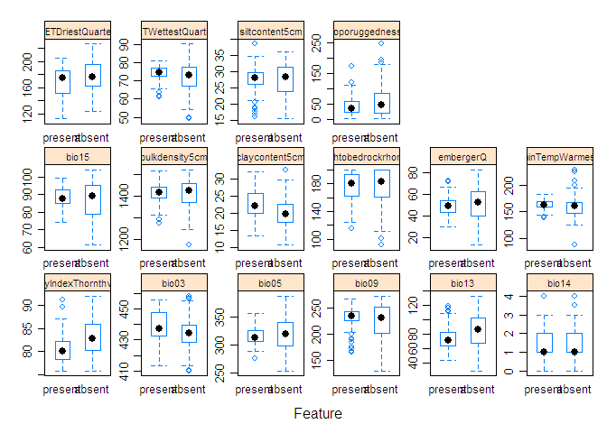
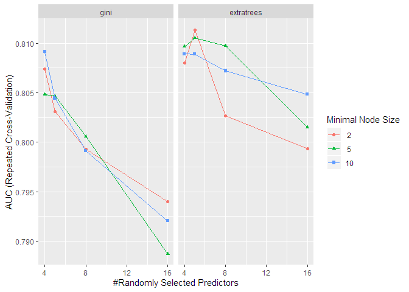

# spadefoot_machinelearning_R
Re-doing some niche modeling analyses for Spea hammondii using more "standard" machine learning methods in R. Used for my (successful) application to the Insight Data Science Fellowship.

Predicting spadefoot toad environmental niche using random forest and
xgboost in R
================
Kevin Neal
November 13, 2019

*last updated May 7, 2020*

## What is Environmental Niche Modeling (i.e Species Distribution Modeling)?

  - predict habitat suitability or likelihood of occupancy for a species
    based on known occurrences and environmental data
  - useful for:
      - predicting new localities
      - understanding biological niche space and environmental variables
        that contribute to creating this space
      - predicting past and future distributions
  - Personal usage: compared model-derived niche space to provide
    evidence for splitting a species of spadefoot toad into two (Neal et
    al. 2018)


*Response variable: binary presence (1) or absence (0)*

*Predictor environmental variables: * Various sources derived from
precipitation and temperature, as well as soil and topography

### Data wrangling: Filtering presence points

  - First, want to filter points that may lie outside the study area or
    have erroneous coordinates (e.g. the point is in the ocean)
  - Want a balanced response variable - while spatial samples may
    accurately reflect species density, more likely it reflects search
    effort, so we want to filter the points
  - This can be distance/radius-based or based on other aspects of the
    localities if we have the metadata
  - Here we’ll sample points using a grid, with one sample point per
    grid cell

<!-- end list -->

``` r
# load points and rasters, filter points, make background/pseudoabsence points
# points from GBIF, Bison, iNaturalist, and Shaffer lab collections
# coords last updated in 2017
present <- read.csv("speahammondii_combined_presence_points.csv")
head(present)
```

    ##            Species Longitude Latitude
    ## 1 Spea_hammondii_S -115.6091 30.12889
    ## 2 Spea_hammondii_S -115.7599 30.19903
    ## 3 Spea_hammondii_S -115.9500 30.76833
    ## 4 Spea_hammondii_S -115.9506 30.76841
    ## 5 Spea_hammondii_S -115.7333 30.96667
    ## 6 Spea_hammondii_S -116.2017 31.06722

``` r
#dim(present)
#dim(unique(present))
```

``` r
socalstack <- stack(list.files(path="./socal_rasters/", pattern="asc$", full.names = TRUE))
socalfilenames <- list.files(path="./socal_rasters/", pattern="asc$", full.names = FALSE)
socalnames <- gsub(pattern="_.*asc", replacement="", socalfilenames)
names(socalstack) <- socalnames

pres.sub <- crop(SpatialPoints(present[,2:3]), socalstack[[1]])

# subsample presence points by a lower-resolution grid

#pres.thin <- gridSample(pres.sub, r=socalstack[[1]])
pres.thin <- gridSample(pres.sub, r=aggregate(socalstack[[1]], fact=4), n=1)

plot(socalstack[[1]], col=viridis(20), main="Spatially subsampled toad presences")
points(pres.sub, pch=4, col="red")
points(pres.thin, pch=20, col="black")
```

<!-- -->

### Generating pseudoabsences

  - Don’t have “true” absences, but we can generate a sample of points
    that cover most of the area in question, but with a buffer around
    the presence points that is unsampled
  - Spatially filter as above, using a grid

<!-- end list -->

``` r
# take a random sample of the background, excluding cells that contain presence points, by masking the raster by the SpatialPoints object

# want a lot of pseudoabsences to get a full representation of the environmental conditions
# subsample by lower-resolution grid
set.seed(99)
absent <- randomPoints(mask=mask(aggregate(socalstack[[1]], fact=4), 
                       buffer(pres.sub, #buffer(SpatialPoints(present[,2:3]), 
                       width=6000), inverse=T), 
                       n=nrow(pres.thin), #consider making imbalanced to allow for wider coverage of the space of environmental variable combinations in the region
                       p=SpatialPoints(present[,2:3]), 
                       excludep=TRUE)
#nrow(gridSample(absent, socalstack[[1]]))

abs.thin <- gridSample(absent, r=socalstack[[1]])
```

``` r
plot(absent, pch=4, col="red")
#points(abs.thin, col="blue")
points(pres.thin, col="green")
```

<!-- -->

``` r
#points
```

``` r
# randomly select from the absences equal to presences to have balanced set
## not needed if n=length(pres.thin) in generating random points
#set.seed(1)
#rows_to_sample <- sample(1:nrow(), nrow(pres.thin))
#abs.thin <- abs.thin[rows_to_sample,] # sample random rows without replacement
dim(abs.thin)
```

    ## [1] 133   2

``` r
dim(pres.thin)
```

    ## [1] 133   2

### Combine presence and absence points into a single dataframe

``` r
# make dataframes specifying point type (present=1, absent=0) 
presabs <- dplyr::union(
  data.frame(pa="present", Longitude=pres.thin[,1], Latitude=pres.thin[,2]), 
  data.frame(pa="absent", Longitude=abs.thin[,1], Latitude=abs.thin[,2])
  )
```

    ## Warning: Column `pa` joining factors with different levels, coercing to
    ## character vector

``` r
presabs[,1] <- as.factor(presabs[,1])
presabs[,1] <- factor(presabs[,1], levels=rev(levels(presabs[,1])))
#head(presabs)
```

### Extract values (predictor variables/features) from environmental layers at each presence and absence point

``` r
# drop features related to urbanization - want the "natural" niche of the species
socalstack <- dropLayer(socalstack, c("canopy", "impervious"))

# extract environmental data at each point
presabs.envdata <- raster::extract(socalstack, presabs[,2:3])
presabs.data <- bind_cols(data.frame(presabs), data.frame(presabs.envdata))

# remove rows with missing data (i.e. points that don't fall on the map)
presabs.data <- presabs.data[complete.cases(presabs.data),]

plot(presabs.data[presabs.data$pa=="present",c(2,3)], col="blue", pch=20)
points(presabs.data[presabs.data$pa=="absent",c(2,3)], col="red", pch=20)
```

<!-- -->

### Remove highly correlated features

  - Inclusion of highly correlated features can bias the models and
    produce misleading feature importances
  - Multiple ways to select features; I’ll use findCorrelation in caret
    to do pairwise removal of variables with spearman’s rho above 0.8

<!-- end list -->

``` r
X <- presabs.data[,-c(1:3)]
y <- presabs.data[,1]
ycoords <- presabs.data[,c(2:3)]

# use caret::findCorrelation to remove correlated variables
# could also use boruta or another mutual information method
library(corrplot)
```

    ## corrplot 0.84 loaded

``` r
library(gplots)
```

    ## 
    ## Attaching package: 'gplots'

    ## The following object is masked from 'package:stats':
    ## 
    ##     lowess

``` r
heatmap.2(abs(cor(X, method="spearman")), symm=T, col=magma(10), trace="none")
```

<!-- -->

``` r
remove.vars <- findCorrelation(cor(X, method="spearman"), cutoff=0.8, names=TRUE, verbose=F, exact=TRUE)
X.sel <- X[, !names(X) %in% remove.vars] # remove the correlated variables
```

``` r
#pairs(presabs.data.sel)
names(X.sel)
```

    ##  [1] "aridityIndexThornthwaite" "bio03"                   
    ##  [3] "bio05"                    "bio09"                   
    ##  [5] "bio13"                    "bio14"                   
    ##  [7] "bio15"                    "bulkdensity5cm"          
    ##  [9] "claycontent5cm"           "depthtobedrockrhorizon"  
    ## [11] "embergerQ"                "minTempWarmest"          
    ## [13] "PETDriestQuarter"         "PETWettestQuarter"       
    ## [15] "siltcontent5cm"           "toporuggedness"

``` r
### findCorrelation is pretty crude. Try Boruta (permuted random forest feature importance)

library(Boruta)
```

    ## Warning: package 'Boruta' was built under R version 3.6.3

    ## Loading required package: ranger

    ## 
    ## Attaching package: 'ranger'

    ## The following object is masked from 'package:randomForest':
    ## 
    ##     importance

``` r
boruta_results <- Boruta(x=X.sel,
                       y=y,
                         doTrace=1,
                       getImp=getImpExtraRaw)
```

    ## After 11 iterations, +2.1 secs:

    ##  confirmed 14 attributes: aridityIndexThornthwaite, bio03, bio05, bio09, bio13 and 9 more;

    ##  still have 2 attributes left.

    ## After 39 iterations, +6.4 secs:

    ##  confirmed 1 attribute: bio14;

    ##  still have 1 attribute left.

    ## After 85 iterations, +13 secs:

    ##  confirmed 1 attribute: depthtobedrockrhorizon;

    ##  no more attributes left.

``` r
boruta_keep = names(boruta_results$finalDecision[boruta_results$finalDecision=="Confirmed"])
boruta_keep
```

    ##  [1] "aridityIndexThornthwaite" "bio03"                   
    ##  [3] "bio05"                    "bio09"                   
    ##  [5] "bio13"                    "bio14"                   
    ##  [7] "bio15"                    "bulkdensity5cm"          
    ##  [9] "claycontent5cm"           "depthtobedrockrhorizon"  
    ## [11] "embergerQ"                "minTempWarmest"          
    ## [13] "PETDriestQuarter"         "PETWettestQuarter"       
    ## [15] "siltcontent5cm"           "toporuggedness"

``` r
X.sel <- X.sel[, names(X.sel) %in% boruta_keep]
```

``` r
# blue = shadow (permuted) variable
# green = higher importance than maximum shadow (permuted) variable
# red = below max shadow importance and should be dropped
par(mar=c(10,5,1,1))
plot(boruta_results, las=2)
```

<!-- -->

``` r
# remove variables from the raster stack
#socalstack.sub <- subset(socalstack, names(socalstack)[!names(socalstack) %in% remove.vars])
socalstack_sub <- subset(socalstack, boruta_keep) #setdiff(names(socalstack), remove.vars))
names(socalstack_sub)
```

    ##  [1] "aridityIndexThornthwaite" "bio03"                   
    ##  [3] "bio05"                    "bio09"                   
    ##  [5] "bio13"                    "bio14"                   
    ##  [7] "bio15"                    "bulkdensity5cm"          
    ##  [9] "claycontent5cm"           "depthtobedrockrhorizon"  
    ## [11] "embergerQ"                "minTempWarmest"          
    ## [13] "PETDriestQuarter"         "PETWettestQuarter"       
    ## [15] "siltcontent5cm"           "toporuggedness"

``` r
# this is the complete dataframe that will be the input in the models
```

### Exploratory data analysis

  - Qualitatively, do any features show clear discrimination between our
    two response classes (presence and absence)?

<!-- end list -->

``` r
# examine distribution of feature values by class
featurePlot(x = X.sel, 
            y = y, # must be factor 
            plot = "box",
            strip=strip.custom(par.strip.text=list(cex=.7)),
            scales = list(x = list(relation="free"), 
                          y = list(relation="free")),
            auto.key=TRUE)
```

<!-- -->

### Modelling using caret

  - Decision trees have proven to be useful for classification; I’ll try
    two ensemble tree methods: random forest (using both gini and
    extratrees) and xgboost and compare the results, and use grid search
    with cross-validation to tune hyperparameters

<!-- end list -->

``` r
# run models using caret, starting with xgboost, then ranger/rf


xgb_trcontrol = trainControl(
  method = "repeatedcv",
  number = 5, 
  repeats = 3,
  allowParallel = TRUE,
  verboseIter = FALSE,
  returnData = FALSE,
  classProbs = TRUE,
  savePredictions = "final",
  #summaryFunction = twoClassSummary #use with metric="ROC" in train(); or use prSummary with AUC
  summaryFunction = prSummary
  #sampling="down"
)
```

``` r
#trainall <- allpts.thin.data
#trainall[,1] <- make.names(trainall[,1])


modelLookup("xgbTree")
```

    ##     model        parameter                          label forReg forClass
    ## 1 xgbTree          nrounds          # Boosting Iterations   TRUE     TRUE
    ## 2 xgbTree        max_depth                 Max Tree Depth   TRUE     TRUE
    ## 3 xgbTree              eta                      Shrinkage   TRUE     TRUE
    ## 4 xgbTree            gamma         Minimum Loss Reduction   TRUE     TRUE
    ## 5 xgbTree colsample_bytree     Subsample Ratio of Columns   TRUE     TRUE
    ## 6 xgbTree min_child_weight Minimum Sum of Instance Weight   TRUE     TRUE
    ## 7 xgbTree        subsample           Subsample Percentage   TRUE     TRUE
    ##   probModel
    ## 1      TRUE
    ## 2      TRUE
    ## 3      TRUE
    ## 4      TRUE
    ## 5      TRUE
    ## 6      TRUE
    ## 7      TRUE

``` r
xgb.grid.large <- expand.grid(nrounds = c(100, 500), # default
                         eta = c(0.1, 0.5), # default
                         max_depth = c(3,5,7,9,11),
                         gamma=0, # default
                         colsample_bytree=1, # default
                         min_child_weight=1, # default
                         subsample=1 # default
                         )


set.seed(99)
xgb_caret <- train(x=X.sel,
                   y=y,
                   trControl=xgb_trcontrol,
                   method="xgbTree",
                   tuneGrid=xgb.grid.large,
                   #metric="ROC", #"AUC"
                   metric="AUC", # good for imbalanced problems
                   importance="permutation")

xgb_caret
```

    ## eXtreme Gradient Boosting 
    ## 
    ## No pre-processing
    ## Resampling: Cross-Validated (5 fold, repeated 3 times) 
    ## Summary of sample sizes: 189, 189, 190, 190, 190, 189, ... 
    ## Resampling results across tuning parameters:
    ## 
    ##   eta  max_depth  nrounds  AUC        Precision  Recall     F        
    ##   0.1   3         100      0.7802920  0.7524703  0.8000000  0.7731001
    ##   0.1   3         500      0.7814504  0.7503296  0.7923077  0.7677371
    ##   0.1   5         100      0.7775202  0.7479210  0.7794872  0.7607144
    ##   0.1   5         500      0.7806055  0.7564200  0.7769231  0.7640455
    ##   0.1   7         100      0.7790684  0.7613452  0.7923077  0.7739717
    ##   0.1   7         500      0.7874797  0.7527468  0.7820513  0.7638836
    ##   0.1   9         100      0.7865439  0.7664328  0.7743590  0.7675804
    ##   0.1   9         500      0.7909215  0.7593479  0.7641026  0.7584912
    ##   0.1  11         100      0.7852958  0.7557505  0.7794872  0.7644330
    ##   0.1  11         500      0.7870352  0.7565970  0.7692308  0.7597446
    ##   0.5   3         100      0.7936276  0.7566556  0.7717949  0.7609828
    ##   0.5   3         500      0.7923096  0.7544997  0.7769231  0.7635167
    ##   0.5   5         100      0.7818561  0.7410045  0.7589744  0.7473459
    ##   0.5   5         500      0.7802379  0.7383093  0.7615385  0.7473807
    ##   0.5   7         100      0.7710730  0.7415014  0.7589744  0.7481825
    ##   0.5   7         500      0.7765464  0.7454939  0.7769231  0.7593205
    ##   0.5   9         100      0.7808888  0.7536181  0.7589744  0.7542029
    ##   0.5   9         500      0.7813374  0.7520212  0.7743590  0.7602551
    ##   0.5  11         100      0.7856980  0.7504891  0.7615385  0.7537277
    ##   0.5  11         500      0.7851781  0.7588478  0.7794872  0.7663191
    ## 
    ## Tuning parameter 'gamma' was held constant at a value of 0
    ##  1
    ## Tuning parameter 'min_child_weight' was held constant at a value of
    ##  1
    ## Tuning parameter 'subsample' was held constant at a value of 1
    ## AUC was used to select the optimal model using the largest value.
    ## The final values used for the model were nrounds = 100, max_depth = 3,
    ##  eta = 0.5, gamma = 0, colsample_bytree = 1, min_child_weight = 1
    ##  and subsample = 1.

``` r
ggplot(xgb_caret)
```

<!-- -->

``` r
# library(rasterVis)
# levelplot(xgb_predtest_prob, par.settings=rasterTheme(parula(20)))
```

``` r
plot(varImp(xgb_caret, scale=F)) # permutation importance
```

<!-- -->

``` r
#modelLookup("ranger")

p = length(names(socalstack_sub))
mtrys = c(
  floor(sqrt(p)),
  floor(p*0.33),
  floor(p*0.5),
  p
)

rf.grid <- expand.grid(
  mtry = mtrys, #c(3,4,5,11),
  splitrule = c("gini", "extratrees"),
  min.node.size = c(2,5,10)
)


set.seed(99)
ranger_caret <- train(x=X.sel,
                   num.trees=500,
                   y=y,
                   trControl=xgb_trcontrol,
                   method="ranger",
                   tuneGrid=rf.grid,
                   #metric="ROC", #"AUC",
                   metric="AUC",
                   importance="permutation")

ranger_caret
```

    ## Random Forest 
    ## 
    ## No pre-processing
    ## Resampling: Cross-Validated (5 fold, repeated 3 times) 
    ## Summary of sample sizes: 189, 189, 190, 190, 190, 189, ... 
    ## Resampling results across tuning parameters:
    ## 
    ##   mtry  splitrule   min.node.size  AUC        Precision  Recall   
    ##    4    gini         2             0.8074170  0.7860491  0.7743590
    ##    4    gini         5             0.8047888  0.7832537  0.7692308
    ##    4    gini        10             0.8091528  0.7926016  0.7512821
    ##    4    extratrees   2             0.8080157  0.7634918  0.8051282
    ##    4    extratrees   5             0.8096885  0.7752549  0.8051282
    ##    4    extratrees  10             0.8089180  0.7818715  0.7871795
    ##    5    gini         2             0.8030810  0.7865016  0.7589744
    ##    5    gini         5             0.8047046  0.7825934  0.7743590
    ##    5    gini        10             0.8044423  0.7814223  0.7435897
    ##    5    extratrees   2             0.8113457  0.7754600  0.8000000
    ##    5    extratrees   5             0.8105226  0.7670817  0.7871795
    ##    5    extratrees  10             0.8089002  0.7908607  0.7794872
    ##    8    gini         2             0.7992805  0.7852010  0.7641026
    ##    8    gini         5             0.8005522  0.7842237  0.7641026
    ##    8    gini        10             0.7991105  0.7892245  0.7512821
    ##    8    extratrees   2             0.8026858  0.7708715  0.7897436
    ##    8    extratrees   5             0.8097606  0.7826051  0.7923077
    ##    8    extratrees  10             0.8072170  0.7792358  0.7871795
    ##   16    gini         2             0.7939996  0.7781613  0.7461538
    ##   16    gini         5             0.7887269  0.7726275  0.7538462
    ##   16    gini        10             0.7920339  0.7835077  0.7435897
    ##   16    extratrees   2             0.7993370  0.7764151  0.7871795
    ##   16    extratrees   5             0.8015223  0.7769410  0.7897436
    ##   16    extratrees  10             0.8048253  0.7933355  0.7769231
    ##   F        
    ##   0.7766162
    ##   0.7722002
    ##   0.7679035
    ##   0.7815631
    ##   0.7867827
    ##   0.7822078
    ##   0.7686388
    ##   0.7749710
    ##   0.7579390
    ##   0.7853610
    ##   0.7737651
    ##   0.7824517
    ##   0.7720765
    ##   0.7707933
    ##   0.7663573
    ##   0.7773587
    ##   0.7848304
    ##   0.7798694
    ##   0.7590185
    ##   0.7597350
    ##   0.7602220
    ##   0.7793292
    ##   0.7805185
    ##   0.7819519
    ## 
    ## AUC was used to select the optimal model using the largest value.
    ## The final values used for the model were mtry = 5, splitrule =
    ##  extratrees and min.node.size = 2.

``` r
ggplot(ranger_caret)
```

<!-- -->

``` r
#
```

``` r
plot(varImp(ranger_caret, scale=F))
```

<!-- -->

## Get mean AUC, precision, recall, F1 for cross-validation folds

### ranger:

``` r
getTrainPerf(ranger_caret)
```

    ##    TrainAUC TrainPrecision TrainRecall   TrainF method
    ## 1 0.8113457        0.77546         0.8 0.785361 ranger

``` r
# equivalent to:
# apply(ranger_caret$resample[,-5], 2, "mean")

confusionMatrix(ranger_caret)
```

    ## Cross-Validated (5 fold, repeated 3 times) Confusion Matrix 
    ## 
    ## (entries are percentual average cell counts across resamples)
    ##  
    ##           Reference
    ## Prediction present absent
    ##    present    43.9   12.9
    ##    absent     11.0   32.2
    ##                             
    ##  Accuracy (average) : 0.7609

``` r
#twoClassSummary(data=ranger_caret$pred, lev=levels(ranger_caret$pred$obs))
#prSummary(data=ranger_caret$pred, lev=levels(ranger_caret$pred$obs))
```

### xgboost:

``` r
getTrainPerf(xgb_caret)
```

    ##    TrainAUC TrainPrecision TrainRecall    TrainF  method
    ## 1 0.7936276      0.7566556   0.7717949 0.7609828 xgbTree

``` r
confusionMatrix(xgb_caret)
```

    ## Cross-Validated (5 fold, repeated 3 times) Confusion Matrix 
    ## 
    ## (entries are percentual average cell counts across resamples)
    ##  
    ##           Reference
    ## Prediction present absent
    ##    present    42.3   13.9
    ##    absent     12.5   31.2
    ##                             
    ##  Accuracy (average) : 0.7356

``` r
#twoClassSummary(data=xgb_caret$pred, lev=levels(xgb_caret$pred$obs))
#prSummary(data=xgb_caret$pred, lev=levels(xgb_caret$pred$obs))
```

### boxplots of cross-validation folds for both models:

``` r
results <- resamples(list(RF=ranger_caret, XGB=xgb_caret))
# summarize the distributions
summary(results)
```

    ## 
    ## Call:
    ## summary.resamples(object = results)
    ## 
    ## Models: RF, XGB 
    ## Number of resamples: 15 
    ## 
    ## AUC 
    ##          Min.   1st Qu.    Median      Mean   3rd Qu.      Max. NA's
    ## RF  0.6906683 0.7613381 0.7878373 0.8113457 0.8677642 0.8952574    0
    ## XGB 0.6825667 0.7452852 0.8047628 0.7936276 0.8403796 0.8980568    0
    ## 
    ## F 
    ##          Min.   1st Qu.    Median      Mean   3rd Qu.      Max. NA's
    ## RF  0.7037037 0.7593103 0.7924528 0.7853610 0.8191721 0.8474576    0
    ## XGB 0.6538462 0.7103424 0.7727273 0.7609828 0.8038462 0.8518519    0
    ## 
    ## Precision 
    ##          Min.   1st Qu.    Median      Mean   3rd Qu.      Max. NA's
    ## RF  0.6785714 0.7363524 0.7857143 0.7754600 0.8204509 0.8461538    0
    ## XGB 0.6538462 0.7060185 0.7500000 0.7566556 0.8003979 0.9444444    0
    ## 
    ## Recall 
    ##          Min.   1st Qu.    Median      Mean   3rd Qu.      Max. NA's
    ## RF  0.6923077 0.7307692 0.8076923 0.8000000 0.8461538 0.9615385    0
    ## XGB 0.6538462 0.6923077 0.7692308 0.7717949 0.8461538 0.8846154    0

``` r
# boxplots of results
bwplot(results)
```

<!-- -->

  - RF and XGBoost perform pretty similarly in cross-validation

## Re-train models on full dataset and do predictions on the rasters

``` r
xgb_trcontrol_fulltrain = trainControl(
  method = "none",
  allowParallel = TRUE,
  verboseIter = FALSE,
  returnData = FALSE,
  classProbs = TRUE,
  savePredictions = "final",
  #summaryFunction = twoClassSummary #use with metric="ROC" in train(); or use prSummary with AUC
  summaryFunction = prSummary
  #sampling="down"
)

set.seed(99)
xgb.grid.best <- expand.grid(nrounds = xgb_caret$bestTune$nrounds,
                         eta = xgb_caret$bestTune$eta,
                         max_depth = xgb_caret$bestTune$max_depth,
                         gamma=xgb_caret$bestTune$gamma, # default
                         colsample_bytree=xgb_caret$bestTune$colsample_bytree, # default
                         min_child_weight=xgb_caret$bestTune$min_child_weight, # default
                         subsample=xgb_caret$bestTune$subsample # default
                         )

xgb_caret_best <- train(x=X.sel,
                   y=y,
                   trControl=xgb_trcontrol_fulltrain,
                   method="xgbTree",
                   tuneGrid=xgb.grid.best,
                   #metric="ROC", #"AUC"
                   metric="AUC",
                   importance="permutation")

xgb_predtest_prob <- raster::predict(socalstack_sub, xgb_caret_best, type="prob") # shows class assignment by default; use type="prob" to show class prob
xgb_predtest_bin <- raster::predict(socalstack_sub, xgb_caret_best, type="raw")

#par(mar=c(2,2,2,1))
#plot(xgb_predtest_prob, col=magma(20), main="presence probability, XGB") 


rf.grid.best <- expand.grid(
  mtry = ranger_caret$bestTune$mtry,
  splitrule = ranger_caret$bestTune$splitrule,
  min.node.size = ranger_caret$bestTune$min.node.size
)

ranger_caret_best <- train(x=X.sel,
                   num.trees=500,
                   y=y,
                   trControl=xgb_trcontrol_fulltrain,
                   method="ranger",
                   tuneGrid=rf.grid.best,
                   #metric="ROC", #"AUC",
                   metric="AUC",
                   importance="permutation")


ranger_predtest_prob <- raster::predict(socalstack_sub, ranger_caret_best, type="prob")
ranger_predtest_bin <- raster::predict(socalstack_sub, ranger_caret_best, type="raw")

#par(mar=c(2,2,2,1))
#plot(ranger_predtest_prob, col=magma(20), main="presence probability, ranger RF")
```

### Visual comparison of predictions

``` r
#par(mfrow=c(1,1))
par(mfrow=c(2,2))
par(mar=c(2,2,2,1))
plot(xgb_predtest_prob, col=magma(20), main="presence probability, XGB")
points(ycoords[y=="present",], col="green")
points(ycoords[y=="absent",], col="red")
plot(ranger_predtest_prob, col=magma(20), main="presence probability, ranger RF")
points(ycoords[y=="present",], col="green")
points(ycoords[y=="absent",], col="red")

plot(2-xgb_predtest_bin, col=magma(20), main="presence (binary), XGB")
points(ycoords[y=="present",], col="green")
points(ycoords[y=="absent",], col="red")
plot(2-ranger_predtest_bin, col=magma(20), main="presence (binary), ranger RF")
points(ycoords[y=="present",], col="green")
points(ycoords[y=="absent",], col="red")
```

<!-- -->

``` r
par(mfrow=c(1,1))
```

``` r
# session info
sessionInfo()
```

    ## R version 3.6.1 (2019-07-05)
    ## Platform: x86_64-w64-mingw32/x64 (64-bit)
    ## Running under: Windows 10 x64 (build 17763)
    ## 
    ## Matrix products: default
    ## 
    ## locale:
    ## [1] LC_COLLATE=English_United States.1252 
    ## [2] LC_CTYPE=English_United States.1252   
    ## [3] LC_MONETARY=English_United States.1252
    ## [4] LC_NUMERIC=C                          
    ## [5] LC_TIME=English_United States.1252    
    ## 
    ## attached base packages:
    ## [1] stats     graphics  grDevices utils     datasets  methods   base     
    ## 
    ## other attached packages:
    ##  [1] Boruta_6.0.0        ranger_0.11.2       gplots_3.0.1.1     
    ##  [4] corrplot_0.84       pals_1.5            maps_3.3.0         
    ##  [7] dplyr_0.8.3         gbm_2.1.5           randomForest_4.6-14
    ## [10] dismo_1.1-4         raster_3.0-7        sp_1.3-1           
    ## [13] xgboost_0.90.0.2    caret_6.0-84        ggplot2_3.2.1      
    ## [16] lattice_0.20-38    
    ## 
    ## loaded via a namespace (and not attached):
    ##  [1] jsonlite_1.6            splines_3.6.1          
    ##  [3] foreach_1.4.7           gtools_3.8.1           
    ##  [5] prodlim_2019.10.13      shiny_1.4.0            
    ##  [7] assertthat_0.2.1        stats4_3.6.1           
    ##  [9] yaml_2.2.0              ipred_0.9-9            
    ## [11] pillar_1.4.2            glue_1.3.1             
    ## [13] MLmetrics_1.1.1         digest_0.6.22          
    ## [15] manipulateWidget_0.10.0 promises_1.1.0         
    ## [17] colorspace_1.4-1        recipes_0.1.7          
    ## [19] htmltools_0.4.0         httpuv_1.5.2           
    ## [21] Matrix_1.2-17           plyr_1.8.4             
    ## [23] timeDate_3043.102       pkgconfig_2.0.3        
    ## [25] purrr_0.3.3             xtable_1.8-4           
    ## [27] scales_1.0.0            webshot_0.5.1          
    ## [29] gdata_2.18.0            later_1.0.0            
    ## [31] gower_0.2.1             lava_1.6.6             
    ## [33] tibble_2.1.3            generics_0.0.2         
    ## [35] withr_2.1.2             ROCR_1.0-7             
    ## [37] nnet_7.3-12             lazyeval_0.2.2         
    ## [39] survival_2.44-1.1       magrittr_1.5           
    ## [41] crayon_1.3.4            mime_0.7               
    ## [43] evaluate_0.14           nlme_3.1-140           
    ## [45] MASS_7.3-51.4           class_7.3-15           
    ## [47] tools_3.6.1             data.table_1.12.6      
    ## [49] stringr_1.4.0           munsell_0.5.0          
    ## [51] e1071_1.7-2             compiler_3.6.1         
    ## [53] caTools_1.17.1.2        rlang_0.4.1            
    ## [55] grid_3.6.1              dichromat_2.0-0        
    ## [57] iterators_1.0.12        htmlwidgets_1.5.1      
    ## [59] crosstalk_1.0.0         miniUI_0.1.1.1         
    ## [61] labeling_0.3            bitops_1.0-6           
    ## [63] rmarkdown_1.16          gtable_0.3.0           
    ## [65] ModelMetrics_1.2.2      codetools_0.2-16       
    ## [67] reshape2_1.4.3          R6_2.4.0               
    ## [69] gridExtra_2.3           lubridate_1.7.4        
    ## [71] knitr_1.25              rgeos_0.5-2            
    ## [73] fastmap_1.0.1           KernSmooth_2.23-15     
    ## [75] stringi_1.4.3           Rcpp_1.0.3             
    ## [77] mapproj_1.2.6           rpart_4.1-15           
    ## [79] rgl_0.100.30            tidyselect_0.2.5       
    ## [81] xfun_0.10
