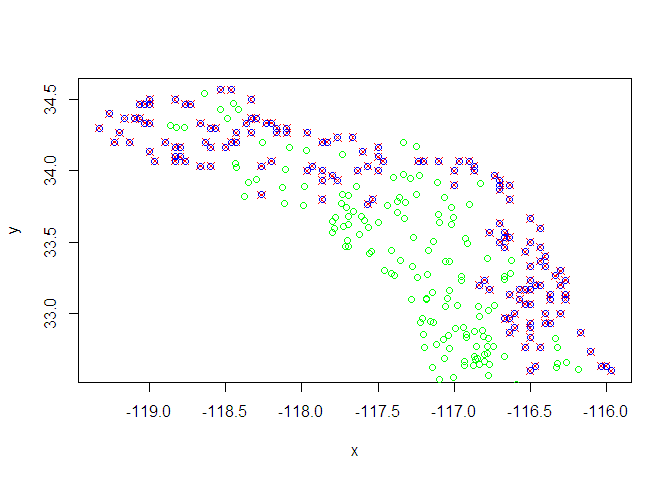

**last updated May 1, 2020**

## What is Environmental Niche Modeling (i.e Species Distribution Modeling)?
- predict habitat suitability or likelihood of occupancy for a species based on known occurrences and environmental data
- useful for:
    - predicting new localities
    - understanding biological niche space and environmental variables that contribute to creating this space
    - predicting past and future distributions
  
- Personal usage: compared model-derived niche space to provide evidence for splitting a species of spadefoot toad into two (Neal et al. 2018)
    

    
 
 


 


__Response variable: binary presence (1) or absence (0) __ 

__Predictor environmental variables: __ 
Various sources derived from precipitation and temperature, as well as soil and topography


### Data wrangling: Filtering presence points
- First, want to filter points that may lie outside the study area or have erroneous coordinates (e.g. the point is in the ocean)
- Want a balanced response variable - while spatial samples may accurately reflect species density, more likely it reflects search effort, so we want to filter the points
- This can be distance/radius-based or based on other aspects of the localities if we have the metadata
- Here we'll sample points using a grid, with one sample point per grid cell


```r
# load points and rasters, filter points, make background/pseudoabsence points
# points from GBIF, Bison, iNaturalist, and Shaffer lab collections
# coords last updated in 2017
present <- read.csv("speahammondii_combined_presence_points.csv")
head(present)
```

```
##            Species Longitude Latitude
## 1 Spea_hammondii_S -115.6091 30.12889
## 2 Spea_hammondii_S -115.7599 30.19903
## 3 Spea_hammondii_S -115.9500 30.76833
## 4 Spea_hammondii_S -115.9506 30.76841
## 5 Spea_hammondii_S -115.7333 30.96667
## 6 Spea_hammondii_S -116.2017 31.06722
```

```r
#dim(present)
#dim(unique(present))
```


```r
socalstack <- stack(list.files(path="./socal_rasters/", pattern="asc$", full.names = TRUE))
socalfilenames <- list.files(path="./socal_rasters/", pattern="asc$", full.names = FALSE)
socalnames <- gsub(pattern="_.*asc", replacement="", socalfilenames)
names(socalstack) <- socalnames

pres.sub <- crop(SpatialPoints(present[,2:3]), socalstack[[1]])

# subsample presence points by a lower-resolution grid

#pres.thin <- gridSample(pres.sub, r=socalstack[[1]])
pres.thin <- gridSample(pres.sub, r=aggregate(socalstack[[1]], fact=3), n=1)

plot(socalstack[[1]], col=viridis(20), main="Spatially subsampled toad presences")
points(pres.sub, pch=4, col="red")
points(pres.thin, pch=20, col="black")
```

<!-- -->


### Generating pseudoabsences
- Don't have "true" absences, but we can generate a sample of points that cover most of the area in question, but with a buffer (2 km or so) around the presence points that is unsampled
- Spatially filter as above, using a grid


```r
# take a random sample of the background, excluding cells that contain presence points, by masking the raster by the SpatialPoints object

# want a lot of pseudoabsences to get a full representation of the environmental conditions
# subsample by lower-resolution grid

absent <- randomPoints(mask=mask(aggregate(socalstack[[1]], fact=2), 
                       buffer(pres.sub, #buffer(SpatialPoints(present[,2:3]), 
                       width=10000), inverse=T), 
                       n=nrow(pres.thin), #keeps classes balanced; higher number would lead to imbalanced classes but more coverage of the space of environmental variable combinations in the region
                       p=SpatialPoints(present[,2:3]), 
                       excludep=TRUE)
#nrow(gridSample(absent, socalstack[[1]]))

abs.thin <- gridSample(absent, r=socalstack[[1]])
```


```r
plot(absent, pch=4, col="red")
points(abs.thin, col="blue")
points(pres.thin, col="green")
```

<!-- -->

```r
#points
```


```r
# randomly select from the absences equal to presences to have balanced set
## not needed if n=length(pres.thin) in generating random points
#set.seed(1)
#rows_to_sample <- sample(1:nrow(), nrow(pres.thin))
#abs.thin <- abs.thin[rows_to_sample,] # sample random rows without replacement
#dim(abs.thin)
```

### Combine presence and absence points into a single dataframe


```r
# make dataframes specifying point type (present=1, absent=0) 
presabs <- dplyr::union(
  data.frame(pa="present", Longitude=pres.thin[,1], Latitude=pres.thin[,2]), 
  data.frame(pa="absent", Longitude=abs.thin[,1], Latitude=abs.thin[,2])
  )
```

```
## Warning: Column `pa` joining factors with different levels, coercing to
## character vector
```

```r
presabs[,1] <- as.factor(presabs[,1])
presabs[,1] <- factor(presabs[,1], levels=rev(levels(presabs[,1])))
#head(presabs)
```


### Extract values (predictor variables/features) from environmental layers at each presence and absence point


```r
# drop features related to urbanization - want the "natural" niche of the species
socalstack <- dropLayer(socalstack, c("canopy", "impervious"))

# extract environmental data at each point
presabs.envdata <- raster::extract(socalstack, presabs[,2:3])
presabs.data <- bind_cols(data.frame(presabs), data.frame(presabs.envdata))

# remove rows with missing data (i.e. points that don't fall on the map)
presabs.data <- presabs.data[complete.cases(presabs.data),]

plot(presabs.data[presabs.data$pa=="present",c(2,3)], col="blue", pch=20)
points(presabs.data[presabs.data$pa=="absent",c(2,3)], col="red", pch=20)
```

<!-- -->

### Remove highly correlated features
- Inclusion of highly correlated features can bias the models and produce misleading feature importances
- Multiple ways to select features; I'll use findCorrelation in caret to do pairwise removal of variables with spearman's rho above 0.7


```r
# use caret::findCorrelation to remove correlated variables
# could also use boruta or another mutual information method
library(corrplot)
```

```
## corrplot 0.84 loaded
```

```r
library(gplots)
```

```
## 
## Attaching package: 'gplots'
```

```
## The following object is masked from 'package:stats':
## 
##     lowess
```

```r
heatmap.2(abs(cor(presabs.data[,-c(1:3)], method="spearman")), symm=T, col=magma(5), trace="none")
```

<!-- -->

```r
remove.vars <- findCorrelation(cor(presabs.data[,-c(1:3)], method="spearman"), cutoff=0.7, names=TRUE, verbose=F)
presabs.data.sel <- presabs.data[, !names(presabs.data) %in% remove.vars] # remove the correlated variables
```


```r
# remove variables from the raster stack
#socalstack.sub <- subset(socalstack, names(socalstack)[!names(socalstack) %in% remove.vars])
socalstack_sub <- subset(socalstack, setdiff(names(socalstack), remove.vars))
names(socalstack_sub)
```

```
##  [1] "aridityIndexThornthwaite" "bio03"                   
##  [3] "bio09"                    "bio14"                   
##  [5] "bio16"                    "bulkdensity5cm"          
##  [7] "claycontent5cm"           "depthtobedrockrhorizon"  
##  [9] "embergerQ"                "minTempWarmest"          
## [11] "PETDriestQuarter"         "siltcontent5cm"          
## [13] "toporuggedness"
```

```r
# this is the complete dataframe that will be the input in the models
```


### Exploratory data analysis
- Qualitatively, do any features show clear discrimination between our two response classes (presence and absence)?


```r
# examine distribution of feature values by class
featurePlot(x = presabs.data.sel[, -c(1:3)], 
            y = presabs.data.sel$pa, # must be factor 
            plot = "box",
            strip=strip.custom(par.strip.text=list(cex=.7)),
            scales = list(x = list(relation="free"), 
                          y = list(relation="free")),
            auto.key=TRUE)
```

<!-- -->

### Modelling using caret
- Decision trees have proven to be useful for classification; I'll try two ensemble tree methods: random forest (using both gini and extratrees) and xgboost and compare the results, and use grid search with cross-validation to tune hyperparameters


```r
# run models using caret, starting with xgboost, then ranger/rf


xgb_trcontrol = trainControl(
  method = "repeatedcv",
  number = 5, 
  repeats = 2,
  allowParallel = TRUE,
  verboseIter = FALSE,
  returnData = FALSE,
  classProbs = TRUE,
  savePredictions = "final",
  #summaryFunction = twoClassSummary #use with metric="ROC" in train(); or use prSummary with AUC
  summaryFunction = prSummary
  #sampling="down"
)
```


```r
#trainall <- allpts.thin.data
#trainall[,1] <- make.names(trainall[,1])

modelLookup("xgbTree")
```

```
##     model        parameter                          label forReg forClass
## 1 xgbTree          nrounds          # Boosting Iterations   TRUE     TRUE
## 2 xgbTree        max_depth                 Max Tree Depth   TRUE     TRUE
## 3 xgbTree              eta                      Shrinkage   TRUE     TRUE
## 4 xgbTree            gamma         Minimum Loss Reduction   TRUE     TRUE
## 5 xgbTree colsample_bytree     Subsample Ratio of Columns   TRUE     TRUE
## 6 xgbTree min_child_weight Minimum Sum of Instance Weight   TRUE     TRUE
## 7 xgbTree        subsample           Subsample Percentage   TRUE     TRUE
##   probModel
## 1      TRUE
## 2      TRUE
## 3      TRUE
## 4      TRUE
## 5      TRUE
## 6      TRUE
## 7      TRUE
```

```r
xgb.grid.large <- expand.grid(nrounds = c(100, 500), # default
                         eta = c(0.1,0.5), # default
                         max_depth = c(3,6,9,11),
                         gamma=0, # default
                         colsample_bytree=1, # default
                         min_child_weight=1, # default
                         subsample=1 # default
                         )


set.seed(99)
xgb_caret <- train(x=presabs.data.sel[,-c(1:3)],
                   y=presabs.data.sel[,1],
                   trControl=xgb_trcontrol,
                   method="xgbTree",
                   tuneGrid=xgb.grid.large,
                   #metric="ROC", #"AUC"
                   metric="AUC", # good for imbalanced problems
                   importance="permutation")

xgb_caret
```

```
## eXtreme Gradient Boosting 
## 
## No pre-processing
## Resampling: Cross-Validated (5 fold, repeated 2 times) 
## Summary of sample sizes: 226, 226, 227, 227, 226, 227, ... 
## Resampling results across tuning parameters:
## 
##   eta  max_depth  nrounds  AUC        Precision  Recall     F        
##   0.1   3         100      0.8710389  0.8356202  0.8264778  0.8294864
##   0.1   3         500      0.8747074  0.8382932  0.8334975  0.8336903
##   0.1   6         100      0.8762866  0.8481600  0.8298030  0.8368337
##   0.1   6         500      0.8768412  0.8411717  0.8370690  0.8377542
##   0.1   9         100      0.8811557  0.8378186  0.8193350  0.8273602
##   0.1   9         500      0.8796943  0.8436455  0.8370690  0.8390319
##   0.1  11         100      0.8820141  0.8429681  0.8263547  0.8329395
##   0.1  11         500      0.8796124  0.8498446  0.8334975  0.8400109
##   0.5   3         100      0.8716210  0.8415863  0.8267241  0.8324452
##   0.5   3         500      0.8720406  0.8354275  0.8401478  0.8360040
##   0.5   6         100      0.8770810  0.8469973  0.8402709  0.8418471
##   0.5   6         500      0.8782615  0.8386273  0.8470443  0.8414295
##   0.5   9         100      0.8749822  0.8438725  0.8508621  0.8456153
##   0.5   9         500      0.8752944  0.8300435  0.8543103  0.8401787
##   0.5  11         100      0.8755229  0.8426873  0.8439655  0.8412502
##   0.5  11         500      0.8756351  0.8283292  0.8439655  0.8337459
## 
## Tuning parameter 'gamma' was held constant at a value of 0
##  1
## Tuning parameter 'min_child_weight' was held constant at a value of
##  1
## Tuning parameter 'subsample' was held constant at a value of 1
## AUC was used to select the optimal model using the largest value.
## The final values used for the model were nrounds = 100, max_depth =
##  11, eta = 0.1, gamma = 0, colsample_bytree = 1, min_child_weight = 1
##  and subsample = 1.
```


```r
# library(rasterVis)
# levelplot(xgb_predtest_prob, par.settings=rasterTheme(parula(20)))
```


```r
plot(varImp(xgb_caret, scale=F)) # permutation importance
```

<!-- -->


```r
twoClassSummary(data=xgb_caret$pred, lev=levels(xgb_caret$pred$obs))
```

```
##       ROC      Sens      Spec 
## 0.9026654 0.8263889 0.8381295
```

```r
prSummary(data=xgb_caret$pred, lev=levels(xgb_caret$pred$obs))
```

```
##       AUC Precision    Recall         F 
## 0.9134611 0.8409894 0.8263889 0.8336252
```

```r
confusionMatrix(xgb_caret)
```

```
## Cross-Validated (5 fold, repeated 2 times) Confusion Matrix 
## 
## (entries are percentual average cell counts across resamples)
##  
##           Reference
## Prediction present absent
##    present    42.0    8.0
##    absent      8.8   41.2
##                             
##  Accuracy (average) : 0.8322
```


```r
#prSummary(xgb_caret)
```


```r
#modelLookup("ranger")
rf.grid <- expand.grid(
  mtry = c(3,4,5,11),
  splitrule = c("gini", "extratrees"),
  min.node.size = c(2,5,10)
)


set.seed(99)
ranger_caret <- train(x=presabs.data.sel[,-c(1:3)],
                   num.trees=500,
                   y=presabs.data.sel[,1],
                   trControl=xgb_trcontrol,
                   method="ranger",
                   tuneGrid=rf.grid,
                   #metric="ROC", #"AUC",
                   metric="AUC",
                   importance="permutation")

ranger_caret
```

```
## Random Forest 
## 
## No pre-processing
## Resampling: Cross-Validated (5 fold, repeated 2 times) 
## Summary of sample sizes: 226, 226, 227, 227, 226, 227, ... 
## Resampling results across tuning parameters:
## 
##   mtry  splitrule   min.node.size  AUC        Precision  Recall   
##    3    gini         2             0.8933098  0.8775111  0.8020936
##    3    gini         5             0.8922593  0.8763012  0.7918719
##    3    gini        10             0.8885266  0.8790030  0.7809113
##    3    extratrees   2             0.9001245  0.8821644  0.8263547
##    3    extratrees   5             0.8970816  0.8643207  0.8160099
##    3    extratrees  10             0.8951760  0.8732112  0.8089901
##    4    gini         2             0.8880519  0.8862220  0.8057882
##    4    gini         5             0.8887626  0.8685239  0.7847291
##    4    gini        10             0.8874409  0.8647489  0.7775862
##    4    extratrees   2             0.8899094  0.8707853  0.8195813
##    4    extratrees   5             0.8975034  0.8750718  0.8299261
##    4    extratrees  10             0.8940097  0.8691511  0.7985222
##    5    gini         2             0.8741451  0.8851964  0.8056650
##    5    gini         5             0.8865163  0.8708990  0.7917488
##    5    gini        10             0.8871909  0.8704921  0.7915025
##    5    extratrees   2             0.8929848  0.8743865  0.8160099
##    5    extratrees   5             0.8964907  0.8701118  0.8123153
##    5    extratrees  10             0.8944345  0.8695188  0.8020936
##   11    gini         2             0.8329390  0.8583434  0.7777094
##   11    gini         5             0.8595295  0.8630069  0.7706897
##   11    gini        10             0.8682895  0.8559640  0.7812808
##   11    extratrees   2             0.8888736  0.8696037  0.8194581
##   11    extratrees   5             0.8946704  0.8791863  0.8197044
##   11    extratrees  10             0.8920505  0.8705347  0.8055419
##   F        
##   0.8357509
##   0.8283312
##   0.8244709
##   0.8511283
##   0.8373313
##   0.8375630
##   0.8412035
##   0.8216954
##   0.8147449
##   0.8421839
##   0.8500028
##   0.8297704
##   0.8403927
##   0.8259611
##   0.8263688
##   0.8420784
##   0.8380881
##   0.8322202
##   0.8136090
##   0.8111747
##   0.8125726
##   0.8412325
##   0.8455630
##   0.8342922
## 
## AUC was used to select the optimal model using the largest value.
## The final values used for the model were mtry = 3, splitrule =
##  extratrees and min.node.size = 2.
```


```r
#
```


```r
plot(varImp(ranger_caret, scale=F))
```

<!-- -->


```r
print("ranger:")
```

```
## [1] "ranger:"
```

```r
twoClassSummary(data=ranger_caret$pred, lev=levels(ranger_caret$pred$obs))
```

```
##       ROC      Sens      Spec 
## 0.9230678 0.8263889 0.8812950
```

```r
prSummary(data=ranger_caret$pred, lev=levels(ranger_caret$pred$obs))
```

```
##       AUC Precision    Recall         F 
## 0.9238974 0.8782288 0.8263889 0.8515206
```

```r
print("xgboost:")
```

```
## [1] "xgboost:"
```

```r
twoClassSummary(data=xgb_caret$pred, lev=levels(xgb_caret$pred$obs))
```

```
##       ROC      Sens      Spec 
## 0.9026654 0.8263889 0.8381295
```

```r
prSummary(data=xgb_caret$pred, lev=levels(xgb_caret$pred$obs))
```

```
##       AUC Precision    Recall         F 
## 0.9134611 0.8409894 0.8263889 0.8336252
```


```r
#confusionMatrix(ranger_caret$pred$pred, ranger_caret$pred$obs, positive="present", mode="everything")
```


```r
print("ranger confusion matrix:")
```

```
## [1] "ranger confusion matrix:"
```

```r
confusionMatrix(ranger_caret)
```

```
## Cross-Validated (5 fold, repeated 2 times) Confusion Matrix 
## 
## (entries are percentual average cell counts across resamples)
##  
##           Reference
## Prediction present absent
##    present    42.0    5.8
##    absent      8.8   43.3
##                             
##  Accuracy (average) : 0.8534
```

```r
confusionMatrix(ranger_caret$pred$pred, ranger_caret$pred$obs, positive="present", mode="everything")
```

```
## Confusion Matrix and Statistics
## 
##           Reference
## Prediction present absent
##    present     238     33
##    absent       50    245
##                                           
##                Accuracy : 0.8534          
##                  95% CI : (0.8215, 0.8815)
##     No Information Rate : 0.5088          
##     P-Value [Acc > NIR] : < 2e-16         
##                                           
##                   Kappa : 0.7069          
##                                           
##  Mcnemar's Test P-Value : 0.07905         
##                                           
##             Sensitivity : 0.8264          
##             Specificity : 0.8813          
##          Pos Pred Value : 0.8782          
##          Neg Pred Value : 0.8305          
##               Precision : 0.8782          
##                  Recall : 0.8264          
##                      F1 : 0.8515          
##              Prevalence : 0.5088          
##          Detection Rate : 0.4205          
##    Detection Prevalence : 0.4788          
##       Balanced Accuracy : 0.8538          
##                                           
##        'Positive' Class : present         
## 
```

```r
print("xgboost confusion matrix:")
```

```
## [1] "xgboost confusion matrix:"
```

```r
confusionMatrix(xgb_caret)
```

```
## Cross-Validated (5 fold, repeated 2 times) Confusion Matrix 
## 
## (entries are percentual average cell counts across resamples)
##  
##           Reference
## Prediction present absent
##    present    42.0    8.0
##    absent      8.8   41.2
##                             
##  Accuracy (average) : 0.8322
```

```r
confusionMatrix(xgb_caret$pred$pred, xgb_caret$pred$obs, positive="present", mode="everything")
```

```
## Confusion Matrix and Statistics
## 
##           Reference
## Prediction present absent
##    present     238     45
##    absent       50    233
##                                          
##                Accuracy : 0.8322         
##                  95% CI : (0.7988, 0.862)
##     No Information Rate : 0.5088         
##     P-Value [Acc > NIR] : <2e-16         
##                                          
##                   Kappa : 0.6643         
##                                          
##  Mcnemar's Test P-Value : 0.6815         
##                                          
##             Sensitivity : 0.8264         
##             Specificity : 0.8381         
##          Pos Pred Value : 0.8410         
##          Neg Pred Value : 0.8233         
##               Precision : 0.8410         
##                  Recall : 0.8264         
##                      F1 : 0.8336         
##              Prevalence : 0.5088         
##          Detection Rate : 0.4205         
##    Detection Prevalence : 0.5000         
##       Balanced Accuracy : 0.8323         
##                                          
##        'Positive' Class : present        
## 
```


- RF (ranger) had a slightly higher ROCAUC, PRAUC, and F1 than xgboost

### Re-train models on full dataset and do predictions on the rasters


```r
xgb_trcontrol_fulltrain = trainControl(
  method = "none",
  allowParallel = TRUE,
  verboseIter = FALSE,
  returnData = FALSE,
  classProbs = TRUE,
  savePredictions = "final",
  #summaryFunction = twoClassSummary #use with metric="ROC" in train(); or use prSummary with AUC
  summaryFunction = prSummary
  #sampling="down"
)

set.seed(99)
xgb.grid.best <- expand.grid(nrounds = 100,
                         eta = 0.1,
                         max_depth = 11,
                         gamma=0, # default
                         colsample_bytree=1, # default
                         min_child_weight=1, # default
                         subsample=1 # default
                         )

xgb_caret_best <- train(x=presabs.data.sel[,-c(1:3)],
                   y=presabs.data.sel[,1],
                   trControl=xgb_trcontrol_fulltrain,
                   method="xgbTree",
                   tuneGrid=xgb.grid.best,
                   #metric="ROC", #"AUC"
                   metric="AUC",
                   importance="permutation")

xgb_predtest_prob <- raster::predict(socalstack_sub, xgb_caret_best, type="prob") # shows class assignment by default; use type="prob" to show class prob
xgb_predtest_bin <- raster::predict(socalstack_sub, xgb_caret_best, type="raw")

#par(mar=c(2,2,2,1))
#plot(xgb_predtest_prob, col=magma(20), main="presence probability, XGB") 


rf.grid.best <- expand.grid(
  mtry = 3,
  splitrule = "extratrees",
  min.node.size = 2
)

ranger_caret_best <- train(x=presabs.data.sel[,-c(1:3)],
                   num.trees=500,
                   y=presabs.data.sel[,1],
                   trControl=xgb_trcontrol_fulltrain,
                   method="ranger",
                   tuneGrid=rf.grid.best,
                   #metric="ROC", #"AUC",
                   metric="AUC",
                   importance="permutation")


ranger_predtest_prob <- raster::predict(socalstack_sub, ranger_caret_best, type="prob")
ranger_predtest_bin <- raster::predict(socalstack_sub, ranger_caret_best, type="raw")

#par(mar=c(2,2,2,1))
#plot(ranger_predtest_prob, col=magma(20), main="presence probability, ranger RF")
```


### Visual comparison of predictions


```r
#par(mfrow=c(1,1))
par(mfrow=c(2,2))
par(mar=c(2,2,2,1))
plot(xgb_predtest_prob, col=magma(20), main="presence probability, XGB")
points(presabs.data.sel[presabs.data.sel$pa=="present",][,c(2,3)])
plot(ranger_predtest_prob, col=magma(20), main="presence probability, ranger RF")
points(presabs.data.sel[presabs.data.sel$pa=="present",][,c(2,3)])

plot(2-xgb_predtest_bin, col=magma(20), main="presence (binary), XGB")
points(presabs.data.sel[presabs.data.sel$pa=="present",][,c(2,3)], col="red")
plot(2-ranger_predtest_bin, col=magma(20), main="presence (binary), ranger RF")
points(presabs.data.sel[presabs.data.sel$pa=="present",][,c(2,3)], col="red")
```

<!-- -->

```r
par(mfrow=c(1,1))
```


```r
results <- resamples(list(RF=ranger_caret, XGB=xgb_caret))
# summarize the distributions
summary(results)
```

```
## 
## Call:
## summary.resamples(object = results)
## 
## Models: RF, XGB 
## Number of resamples: 10 
## 
## AUC 
##          Min.   1st Qu.    Median      Mean   3rd Qu.      Max. NA's
## RF  0.8259707 0.8928641 0.9055257 0.9001245 0.9262205 0.9596626    0
## XGB 0.8073743 0.8644643 0.8907673 0.8820141 0.9134025 0.9302957    0
## 
## F 
##          Min.   1st Qu.    Median      Mean   3rd Qu.      Max. NA's
## RF  0.7307692 0.8143541 0.8730159 0.8511283 0.8946360 0.9056604    0
## XGB 0.7777778 0.8170660 0.8363636 0.8329395 0.8461195 0.9032258    0
## 
## Precision 
##          Min.   1st Qu.    Median      Mean   3rd Qu. Max. NA's
## RF  0.7741935 0.8325282 0.8799283 0.8821644 0.9441379 1.00    0
## XGB 0.7666667 0.8290230 0.8442424 0.8429681 0.8558201 0.92    0
## 
## Recall 
##          Min.   1st Qu.    Median      Mean   3rd Qu.      Max. NA's
## RF  0.6551724 0.8229680 0.8275862 0.8263547 0.8275862 0.9310345    0
## XGB 0.7241379 0.8001847 0.8245074 0.8263547 0.8275862 0.9655172    0
```

```r
# boxplots of results
bwplot(results)
```

<!-- -->


