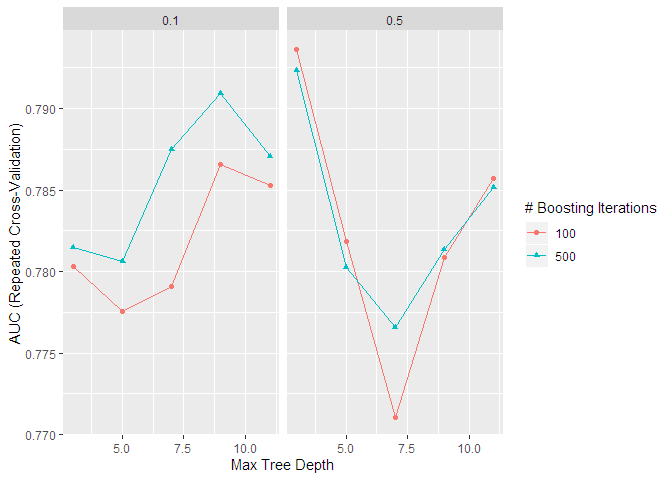
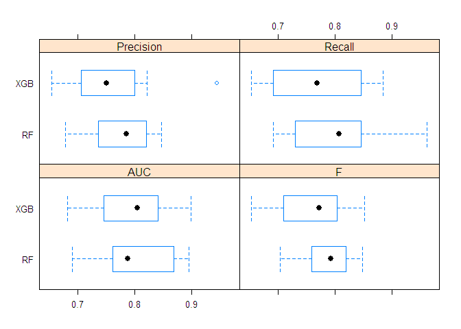
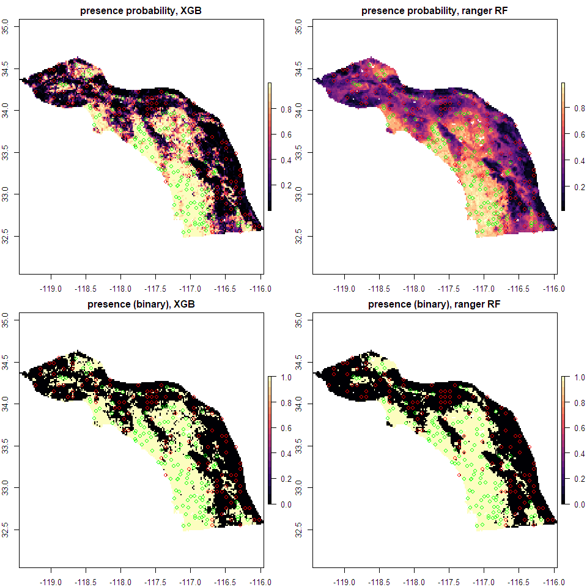

Predicting spadefoot toad environmental niche using random forest and
xgboost in R
================
Kevin Neal
November 13, 2019

*last updated May 7, 2020*

## What is Environmental Niche Modeling (i.e Species Distribution Modeling)?

  - predict habitat suitability or likelihood of occupancy for a species
    based on known occurrences and environmental data
  - useful for:
      - predicting new localities
      - understanding biological niche space and environmental variables
        that contribute to creating this space
      - predicting past and future distributions
  - Personal usage: compared model-derived niche space to provide
    evidence for splitting a species of spadefoot toad into two (Neal et
    al. 2018)


*Response variable: binary presence (1) or absence (0)*

*Predictor environmental variables: * Various sources derived from
precipitation and temperature, as well as soil and topography

### Data wrangling: Filtering presence points

  - First, want to filter points that may lie outside the study area or
    have erroneous coordinates (e.g. the point is in the ocean)
  - Want a balanced response variable - while spatial samples may
    accurately reflect species density, more likely it reflects search
    effort, so we want to filter the points
  - This can be distance/radius-based or based on other aspects of the
    localities if we have the metadata
  - Here we’ll sample points using a grid, with one sample point per
    grid cell

<!-- end list -->

``` r
# load points and rasters, filter points, make background/pseudoabsence points
# points from GBIF, Bison, iNaturalist, and Shaffer lab collections
# coords last updated in 2017
present <- read.csv("speahammondii_combined_presence_points.csv")
head(present)
```

    ##            Species Longitude Latitude
    ## 1 Spea_hammondii_S -115.6091 30.12889
    ## 2 Spea_hammondii_S -115.7599 30.19903
    ## 3 Spea_hammondii_S -115.9500 30.76833
    ## 4 Spea_hammondii_S -115.9506 30.76841
    ## 5 Spea_hammondii_S -115.7333 30.96667
    ## 6 Spea_hammondii_S -116.2017 31.06722

``` r
#dim(present)
#dim(unique(present))
```

``` r
socalstack <- stack(list.files(path="./socal_rasters/", pattern="asc$", full.names = TRUE))
socalfilenames <- list.files(path="./socal_rasters/", pattern="asc$", full.names = FALSE)
socalnames <- gsub(pattern="_.*asc", replacement="", socalfilenames)
names(socalstack) <- socalnames

pres.sub <- crop(SpatialPoints(present[,2:3]), socalstack[[1]])

# subsample presence points by a lower-resolution grid

#pres.thin <- gridSample(pres.sub, r=socalstack[[1]])
pres.thin <- gridSample(pres.sub, r=aggregate(socalstack[[1]], fact=4), n=1)

plot(socalstack[[1]], col=viridis(20), main="Spatially subsampled toad presences")
points(pres.sub, pch=4, col="red")
points(pres.thin, pch=20, col="black")
```

<!-- -->

### Generating pseudoabsences

  - Don’t have “true” absences, but we can generate a sample of points
    that cover most of the area in question, but with a buffer (2 km or
    so) around the presence points that is unsampled
  - Spatially filter as above, using a grid

<!-- end list -->

``` r
# take a random sample of the background, excluding cells that contain presence points, by masking the raster by the SpatialPoints object

# want a lot of pseudoabsences to get a full representation of the environmental conditions
# subsample by lower-resolution grid
set.seed(99)
absent <- randomPoints(mask=mask(aggregate(socalstack[[1]], fact=4), 
                       buffer(pres.sub, #buffer(SpatialPoints(present[,2:3]), 
                       width=6000), inverse=T), 
                       n=nrow(pres.thin), #consider making imbalanced to allow for wider coverage of the space of environmental variable combinations in the region
                       p=SpatialPoints(present[,2:3]), 
                       excludep=TRUE)
#nrow(gridSample(absent, socalstack[[1]]))

abs.thin <- gridSample(absent, r=socalstack[[1]])
```

``` r
plot(absent, pch=4, col="red")
#points(abs.thin, col="blue")
points(pres.thin, col="green")
```

<!-- -->

``` r
#points
```

``` r
# randomly select from the absences equal to presences to have balanced set
## not needed if n=length(pres.thin) in generating random points
#set.seed(1)
#rows_to_sample <- sample(1:nrow(), nrow(pres.thin))
#abs.thin <- abs.thin[rows_to_sample,] # sample random rows without replacement
dim(abs.thin)
```

    ## [1] 133   2

``` r
dim(pres.thin)
```

    ## [1] 133   2

### Combine presence and absence points into a single dataframe

``` r
# make dataframes specifying point type (present=1, absent=0) 
presabs <- dplyr::union(
  data.frame(pa="present", Longitude=pres.thin[,1], Latitude=pres.thin[,2]), 
  data.frame(pa="absent", Longitude=abs.thin[,1], Latitude=abs.thin[,2])
  )
```

    ## Warning: Column `pa` joining factors with different levels, coercing to
    ## character vector

``` r
presabs[,1] <- as.factor(presabs[,1])
presabs[,1] <- factor(presabs[,1], levels=rev(levels(presabs[,1])))
#head(presabs)
```

### Extract values (predictor variables/features) from environmental layers at each presence and absence point

``` r
# drop features related to urbanization - want the "natural" niche of the species
socalstack <- dropLayer(socalstack, c("canopy", "impervious"))

# extract environmental data at each point
presabs.envdata <- raster::extract(socalstack, presabs[,2:3])
presabs.data <- bind_cols(data.frame(presabs), data.frame(presabs.envdata))

# remove rows with missing data (i.e. points that don't fall on the map)
presabs.data <- presabs.data[complete.cases(presabs.data),]

plot(presabs.data[presabs.data$pa=="present",c(2,3)], col="blue", pch=20)
points(presabs.data[presabs.data$pa=="absent",c(2,3)], col="red", pch=20)
```

<!-- -->

### Remove highly correlated features

  - Inclusion of highly correlated features can bias the models and
    produce misleading feature importances
  - Multiple ways to select features; I’ll use findCorrelation in caret
    to do pairwise removal of variables with spearman’s rho above 0.8

<!-- end list -->

``` r
# use caret::findCorrelation to remove correlated variables
# could also use boruta or another mutual information method
library(corrplot)
```

    ## corrplot 0.84 loaded

``` r
library(gplots)
```

    ## 
    ## Attaching package: 'gplots'

    ## The following object is masked from 'package:stats':
    ## 
    ##     lowess

``` r
heatmap.2(abs(cor(presabs.data[,-c(1:3)], method="spearman")), symm=T, col=magma(10), trace="none")
```

<!-- -->

``` r
remove.vars <- findCorrelation(cor(presabs.data[,-c(1:3)], method="spearman"), cutoff=0.8, names=TRUE, verbose=F, exact=TRUE)
presabs.data.sel <- presabs.data[, !names(presabs.data) %in% remove.vars] # remove the correlated variables
```

``` r
#pairs(presabs.data.sel)
names(presabs.data.sel)[-c(1:3)]
```

    ##  [1] "aridityIndexThornthwaite" "bio03"                   
    ##  [3] "bio05"                    "bio09"                   
    ##  [5] "bio13"                    "bio14"                   
    ##  [7] "bio15"                    "bulkdensity5cm"          
    ##  [9] "claycontent5cm"           "depthtobedrockrhorizon"  
    ## [11] "embergerQ"                "minTempWarmest"          
    ## [13] "PETDriestQuarter"         "PETWettestQuarter"       
    ## [15] "siltcontent5cm"           "slopedeg"

``` r
### findCorrelation is pretty crude. Try Boruta (permuted random forest feature importance)

library(Boruta)
```

    ## Warning: package 'Boruta' was built under R version 3.6.3

    ## Loading required package: ranger

    ## 
    ## Attaching package: 'ranger'

    ## The following object is masked from 'package:randomForest':
    ## 
    ##     importance

``` r
boruta_results <- Boruta(x=presabs.data.sel[,-c(1:3)],
                       y=presabs.data.sel[,1],
                         doTrace=1,
                       getImp=getImpExtraGini)
```

    ## After 11 iterations, +1.9 secs:

    ##  confirmed 8 attributes: aridityIndexThornthwaite, bio05, bio09, bio13, bio15 and 3 more;

    ##  still have 8 attributes left.

    ## After 15 iterations, +2.4 secs:

    ##  confirmed 2 attributes: bulkdensity5cm, embergerQ;

    ##  still have 6 attributes left.

    ## After 19 iterations, +2.9 secs:

    ##  confirmed 2 attributes: claycontent5cm, minTempWarmest;

    ##  still have 4 attributes left.

    ## After 22 iterations, +3.2 secs:

    ##  confirmed 1 attribute: PETDriestQuarter;

    ##  still have 3 attributes left.

    ## After 28 iterations, +3.9 secs:

    ##  confirmed 1 attribute: bio03;

    ##  still have 2 attributes left.

``` r
boruta_remove = names(boruta_results$finalDecision[boruta_results$finalDecision=="Rejected"])
names(boruta_results$finalDecision[boruta_results$finalDecision=="Confirmed"])
```

    ##  [1] "aridityIndexThornthwaite" "bio03"                   
    ##  [3] "bio05"                    "bio09"                   
    ##  [5] "bio13"                    "bio15"                   
    ##  [7] "bulkdensity5cm"           "claycontent5cm"          
    ##  [9] "embergerQ"                "minTempWarmest"          
    ## [11] "PETDriestQuarter"         "PETWettestQuarter"       
    ## [13] "siltcontent5cm"           "slopedeg"

``` r
presabs.data.sel <- presabs.data.sel[, !names(presabs.data.sel) %in% boruta_remove]
```

``` r
# blue = shadow (permuted) variable
# green = higher importance than maximum shadow (permuted) variable
# red = below max shadow importance and should be dropped
plot(boruta_results, las=2)
```

<!-- -->

``` r
# remove variables from the raster stack
#socalstack.sub <- subset(socalstack, names(socalstack)[!names(socalstack) %in% remove.vars])
socalstack_sub <- subset(socalstack, setdiff(names(socalstack), remove.vars))
names(socalstack_sub)
```

    ##  [1] "aridityIndexThornthwaite" "bio03"                   
    ##  [3] "bio05"                    "bio09"                   
    ##  [5] "bio13"                    "bio14"                   
    ##  [7] "bio15"                    "bulkdensity5cm"          
    ##  [9] "claycontent5cm"           "depthtobedrockrhorizon"  
    ## [11] "embergerQ"                "minTempWarmest"          
    ## [13] "PETDriestQuarter"         "PETWettestQuarter"       
    ## [15] "siltcontent5cm"           "slopedeg"

``` r
# this is the complete dataframe that will be the input in the models
```

### Exploratory data analysis

  - Qualitatively, do any features show clear discrimination between our
    two response classes (presence and absence)?

<!-- end list -->

``` r
# examine distribution of feature values by class
featurePlot(x = presabs.data.sel[, -c(1:3)], 
            y = presabs.data.sel$pa, # must be factor 
            plot = "box",
            strip=strip.custom(par.strip.text=list(cex=.7)),
            scales = list(x = list(relation="free"), 
                          y = list(relation="free")),
            auto.key=TRUE)
```

<!-- -->

### Modelling using caret

  - Decision trees have proven to be useful for classification; I’ll try
    two ensemble tree methods: random forest (using both gini and
    extratrees) and xgboost and compare the results, and use grid search
    with cross-validation to tune hyperparameters

<!-- end list -->

``` r
# run models using caret, starting with xgboost, then ranger/rf


xgb_trcontrol = trainControl(
  method = "repeatedcv",
  number = 5, 
  repeats = 3,
  allowParallel = TRUE,
  verboseIter = FALSE,
  returnData = FALSE,
  classProbs = TRUE,
  savePredictions = "final",
  #summaryFunction = twoClassSummary #use with metric="ROC" in train(); or use prSummary with AUC
  summaryFunction = prSummary
  #sampling="down"
)
```

``` r
#trainall <- allpts.thin.data
#trainall[,1] <- make.names(trainall[,1])


modelLookup("xgbTree")
```

    ##     model        parameter                          label forReg forClass
    ## 1 xgbTree          nrounds          # Boosting Iterations   TRUE     TRUE
    ## 2 xgbTree        max_depth                 Max Tree Depth   TRUE     TRUE
    ## 3 xgbTree              eta                      Shrinkage   TRUE     TRUE
    ## 4 xgbTree            gamma         Minimum Loss Reduction   TRUE     TRUE
    ## 5 xgbTree colsample_bytree     Subsample Ratio of Columns   TRUE     TRUE
    ## 6 xgbTree min_child_weight Minimum Sum of Instance Weight   TRUE     TRUE
    ## 7 xgbTree        subsample           Subsample Percentage   TRUE     TRUE
    ##   probModel
    ## 1      TRUE
    ## 2      TRUE
    ## 3      TRUE
    ## 4      TRUE
    ## 5      TRUE
    ## 6      TRUE
    ## 7      TRUE

``` r
xgb.grid.large <- expand.grid(nrounds = c(100, 500), # default
                         eta = c(0.1, 0.5), # default
                         max_depth = c(3,5,7,9,11),
                         gamma=0, # default
                         colsample_bytree=1, # default
                         min_child_weight=1, # default
                         subsample=1 # default
                         )


set.seed(99)
xgb_caret <- train(x=presabs.data.sel[,-c(1:3)],
                   y=presabs.data.sel[,1],
                   trControl=xgb_trcontrol,
                   method="xgbTree",
                   tuneGrid=xgb.grid.large,
                   #metric="ROC", #"AUC"
                   metric="AUC", # good for imbalanced problems
                   importance="permutation")

xgb_caret
```

    ## eXtreme Gradient Boosting 
    ## 
    ## No pre-processing
    ## Resampling: Cross-Validated (5 fold, repeated 3 times) 
    ## Summary of sample sizes: 189, 189, 190, 190, 190, 189, ... 
    ## Resampling results across tuning parameters:
    ## 
    ##   eta  max_depth  nrounds  AUC        Precision  Recall     F        
    ##   0.1   3         100      0.7779450  0.7627476  0.7717949  0.7634679
    ##   0.1   3         500      0.7787066  0.7565923  0.7717949  0.7608827
    ##   0.1   5         100      0.7654398  0.7611661  0.7769231  0.7661684
    ##   0.1   5         500      0.7632664  0.7586701  0.7666667  0.7599809
    ##   0.1   7         100      0.7676876  0.7574318  0.7743590  0.7635683
    ##   0.1   7         500      0.7642562  0.7574871  0.7769231  0.7639176
    ##   0.1   9         100      0.7703359  0.7642714  0.7666667  0.7624472
    ##   0.1   9         500      0.7685354  0.7639327  0.7743590  0.7659311
    ##   0.1  11         100      0.7702608  0.7726839  0.7743590  0.7707444
    ##   0.1  11         500      0.7697069  0.7650869  0.7871795  0.7731607
    ##   0.5   3         100      0.7735808  0.7495707  0.7743590  0.7580453
    ##   0.5   3         500      0.7581009  0.7310803  0.7717949  0.7481748
    ##   0.5   5         100      0.7688365  0.7477368  0.7641026  0.7516214
    ##   0.5   5         500      0.7664393  0.7493844  0.7615385  0.7519283
    ##   0.5   7         100      0.7775752  0.7480105  0.7717949  0.7569275
    ##   0.5   7         500      0.7721763  0.7506877  0.7794872  0.7615194
    ##   0.5   9         100      0.7738617  0.7540942  0.7794872  0.7644504
    ##   0.5   9         500      0.7678782  0.7511613  0.7769231  0.7611368
    ##   0.5  11         100      0.7697759  0.7605205  0.7820513  0.7689270
    ##   0.5  11         500      0.7632125  0.7540830  0.7743590  0.7614089
    ## 
    ## Tuning parameter 'gamma' was held constant at a value of 0
    ##  1
    ## Tuning parameter 'min_child_weight' was held constant at a value of
    ##  1
    ## Tuning parameter 'subsample' was held constant at a value of 1
    ## AUC was used to select the optimal model using the largest value.
    ## The final values used for the model were nrounds = 500, max_depth = 3,
    ##  eta = 0.1, gamma = 0, colsample_bytree = 1, min_child_weight = 1
    ##  and subsample = 1.

``` r
ggplot(xgb_caret)
```

<!-- -->

``` r
# library(rasterVis)
# levelplot(xgb_predtest_prob, par.settings=rasterTheme(parula(20)))
```

``` r
plot(varImp(xgb_caret, scale=F)) # permutation importance
```

<!-- -->

``` r
#modelLookup("ranger")

p = length(names(socalstack_sub))
mtrys = c(
  floor(sqrt(p)),
  floor(p*0.33),
  floor(p*0.5),
  p
)

rf.grid <- expand.grid(
  mtry = mtrys, #c(3,4,5,11),
  splitrule = c("gini", "extratrees"),
  min.node.size = c(2,5,10)
)


set.seed(99)
ranger_caret <- train(x=presabs.data.sel[,-c(1:3)],
                   num.trees=500,
                   y=presabs.data.sel[,1],
                   trControl=xgb_trcontrol,
                   method="ranger",
                   tuneGrid=rf.grid,
                   #metric="ROC", #"AUC",
                   metric="AUC",
                   importance="permutation")

ranger_caret
```

    ## Random Forest 
    ## 
    ## No pre-processing
    ## Resampling: Cross-Validated (5 fold, repeated 3 times) 
    ## Summary of sample sizes: 189, 189, 190, 190, 190, 189, ... 
    ## Resampling results across tuning parameters:
    ## 
    ##   mtry  splitrule   min.node.size  AUC        Precision  Recall   
    ##    4    gini         2             0.8039988  0.7793598  0.7717949
    ##    4    gini         5             0.8077252  0.7813589  0.7717949
    ##    4    gini        10             0.8065600  0.7779781  0.7512821
    ##    4    extratrees   2             0.8090498  0.7555742  0.7897436
    ##    4    extratrees   5             0.8074782  0.7677825  0.7974359
    ##    4    extratrees  10             0.8075443  0.7865819  0.7794872
    ##    5    gini         2             0.8040089  0.7693822  0.7641026
    ##    5    gini         5             0.8033172  0.7763334  0.7666667
    ##    5    gini        10             0.8061833  0.7735382  0.7487179
    ##    5    extratrees   2             0.8075687  0.7599679  0.7871795
    ##    5    extratrees   5             0.8108898  0.7653795  0.7897436
    ##    5    extratrees  10             0.8078517  0.7824822  0.7743590
    ##    8    gini         2             0.8043434  0.7751933  0.7641026
    ##    8    gini         5             0.8031684  0.7737479  0.7641026
    ##    8    gini        10             0.8005676  0.7777338  0.7384615
    ##    8    extratrees   2             0.8077271  0.7607164  0.7743590
    ##    8    extratrees   5             0.8062024  0.7647728  0.7897436
    ##    8    extratrees  10             0.8069400  0.7883258  0.7794872
    ##   16    gini         2             0.7965951  0.7707157  0.7461538
    ##   16    gini         5             0.7925394  0.7745940  0.7461538
    ##   16    gini        10             0.8012957  0.7837038  0.7435897
    ##   16    extratrees   2             0.8031982  0.7788889  0.7820513
    ##   16    extratrees   5             0.8040595  0.7746199  0.7692308
    ##   16    extratrees  10             0.8047191  0.7840042  0.7666667
    ##   F        
    ##   0.7714324
    ##   0.7735954
    ##   0.7594853
    ##   0.7704237
    ##   0.7801398
    ##   0.7797689
    ##   0.7634970
    ##   0.7673215
    ##   0.7566031
    ##   0.7708810
    ##   0.7748976
    ##   0.7755470
    ##   0.7662260
    ##   0.7647835
    ##   0.7539162
    ##   0.7650490
    ##   0.7751986
    ##   0.7806740
    ##   0.7537437
    ##   0.7556646
    ##   0.7598850
    ##   0.7780180
    ##   0.7690966
    ##   0.7713067
    ## 
    ## AUC was used to select the optimal model using the largest value.
    ## The final values used for the model were mtry = 5, splitrule =
    ##  extratrees and min.node.size = 5.

``` r
ggplot(ranger_caret)
```

<!-- -->

``` r
#
```

``` r
plot(varImp(ranger_caret, scale=F))
```

<!-- -->

## Get mean AUC, precision, recall, F1 for cross-validation folds

### ranger:

``` r
getTrainPerf(ranger_caret)
```

    ##    TrainAUC TrainPrecision TrainRecall    TrainF method
    ## 1 0.8108898      0.7653795   0.7897436 0.7748976 ranger

``` r
# equivalent to:
# apply(ranger_caret$resample[,-5], 2, "mean")

confusionMatrix(ranger_caret)
```

    ## Cross-Validated (5 fold, repeated 3 times) Confusion Matrix 
    ## 
    ## (entries are percentual average cell counts across resamples)
    ##  
    ##           Reference
    ## Prediction present absent
    ##    present    43.3   13.5
    ##    absent     11.5   31.6
    ##                             
    ##  Accuracy (average) : 0.7496

``` r
#twoClassSummary(data=ranger_caret$pred, lev=levels(ranger_caret$pred$obs))
#prSummary(data=ranger_caret$pred, lev=levels(ranger_caret$pred$obs))
```

### xgboost:

``` r
getTrainPerf(xgb_caret)
```

    ##    TrainAUC TrainPrecision TrainRecall    TrainF  method
    ## 1 0.7787066      0.7565923   0.7717949 0.7608827 xgbTree

``` r
confusionMatrix(xgb_caret)
```

    ## Cross-Validated (5 fold, repeated 3 times) Confusion Matrix 
    ## 
    ## (entries are percentual average cell counts across resamples)
    ##  
    ##           Reference
    ## Prediction present absent
    ##    present    42.3   14.1
    ##    absent     12.5   31.1
    ##                             
    ##  Accuracy (average) : 0.7342

``` r
#twoClassSummary(data=xgb_caret$pred, lev=levels(xgb_caret$pred$obs))
#prSummary(data=xgb_caret$pred, lev=levels(xgb_caret$pred$obs))
```

### boxplots of cross-validation folds for both models:

``` r
results <- resamples(list(RF=ranger_caret, XGB=xgb_caret))
# summarize the distributions
summary(results)
```

    ## 
    ## Call:
    ## summary.resamples(object = results)
    ## 
    ## Models: RF, XGB 
    ## Number of resamples: 15 
    ## 
    ## AUC 
    ##          Min.   1st Qu.    Median      Mean   3rd Qu.      Max. NA's
    ## RF  0.6982896 0.7599736 0.8034782 0.8108898 0.8684716 0.9011816    0
    ## XGB 0.6540152 0.7386817 0.7872647 0.7787066 0.8181921 0.8717487    0
    ## 
    ## F 
    ##          Min.   1st Qu.    Median      Mean   3rd Qu.      Max. NA's
    ## RF  0.6938776 0.7310396 0.7692308 0.7748976 0.8275862 0.8518519    0
    ## XGB 0.6296296 0.7114625 0.7547170 0.7608827 0.8124186 0.8888889    0
    ## 
    ## Precision 
    ##          Min.   1st Qu.    Median      Mean   3rd Qu.      Max. NA's
    ## RF  0.7000000 0.7200000 0.7500000 0.7653795 0.7953297 0.9090909    0
    ## XGB 0.6071429 0.6948276 0.7407407 0.7565923 0.8285714 0.9047619    0
    ## 
    ## Recall 
    ##          Min.   1st Qu.    Median      Mean   3rd Qu.      Max. NA's
    ## RF  0.6538462 0.7307692 0.7692308 0.7897436 0.8461538 0.9230769    0
    ## XGB 0.6153846 0.7115385 0.7692308 0.7717949 0.8076923 0.9615385    0

``` r
# boxplots of results
bwplot(results)
```

<!-- -->

  - RF and XGBoost perform pretty similarly in cross-validation

## Re-train models on full dataset and do predictions on the rasters

``` r
xgb_trcontrol_fulltrain = trainControl(
  method = "none",
  allowParallel = TRUE,
  verboseIter = FALSE,
  returnData = FALSE,
  classProbs = TRUE,
  savePredictions = "final",
  #summaryFunction = twoClassSummary #use with metric="ROC" in train(); or use prSummary with AUC
  summaryFunction = prSummary
  #sampling="down"
)

set.seed(99)
xgb.grid.best <- expand.grid(nrounds = xgb_caret$bestTune$nrounds,
                         eta = xgb_caret$bestTune$eta,
                         max_depth = xgb_caret$bestTune$max_depth,
                         gamma=xgb_caret$bestTune$gamma, # default
                         colsample_bytree=xgb_caret$bestTune$colsample_bytree, # default
                         min_child_weight=xgb_caret$bestTune$min_child_weight, # default
                         subsample=xgb_caret$bestTune$subsample # default
                         )

xgb_caret_best <- train(x=presabs.data.sel[,-c(1:3)],
                   y=presabs.data.sel[,1],
                   trControl=xgb_trcontrol_fulltrain,
                   method="xgbTree",
                   tuneGrid=xgb.grid.best,
                   #metric="ROC", #"AUC"
                   metric="AUC",
                   importance="permutation")

xgb_predtest_prob <- raster::predict(socalstack_sub, xgb_caret_best, type="prob") # shows class assignment by default; use type="prob" to show class prob
xgb_predtest_bin <- raster::predict(socalstack_sub, xgb_caret_best, type="raw")

#par(mar=c(2,2,2,1))
#plot(xgb_predtest_prob, col=magma(20), main="presence probability, XGB") 


rf.grid.best <- expand.grid(
  mtry = ranger_caret$bestTune$mtry,
  splitrule = ranger_caret$bestTune$splitrule,
  min.node.size = ranger_caret$bestTune$min.node.size
)

ranger_caret_best <- train(x=presabs.data.sel[,-c(1:3)],
                   num.trees=500,
                   y=presabs.data.sel[,1],
                   trControl=xgb_trcontrol_fulltrain,
                   method="ranger",
                   tuneGrid=rf.grid.best,
                   #metric="ROC", #"AUC",
                   metric="AUC",
                   importance="permutation")


ranger_predtest_prob <- raster::predict(socalstack_sub, ranger_caret_best, type="prob")
ranger_predtest_bin <- raster::predict(socalstack_sub, ranger_caret_best, type="raw")

#par(mar=c(2,2,2,1))
#plot(ranger_predtest_prob, col=magma(20), main="presence probability, ranger RF")
```

### Visual comparison of predictions

``` r
#par(mfrow=c(1,1))
par(mfrow=c(2,2))
par(mar=c(2,2,2,1))
plot(xgb_predtest_prob, col=magma(20), main="presence probability, XGB")
points(presabs.data.sel[presabs.data.sel$pa=="present",][,c(2,3)])
plot(ranger_predtest_prob, col=magma(20), main="presence probability, ranger RF")
points(presabs.data.sel[presabs.data.sel$pa=="present",][,c(2,3)])

plot(2-xgb_predtest_bin, col=magma(20), main="presence (binary), XGB")
points(presabs.data.sel[presabs.data.sel$pa=="present",][,c(2,3)], col="red")
plot(2-ranger_predtest_bin, col=magma(20), main="presence (binary), ranger RF")
points(presabs.data.sel[presabs.data.sel$pa=="present",][,c(2,3)], col="red")
```

<!-- -->

``` r
par(mfrow=c(1,1))
```

``` r
# session info
sessionInfo()
```

    ## R version 3.6.1 (2019-07-05)
    ## Platform: x86_64-w64-mingw32/x64 (64-bit)
    ## Running under: Windows 10 x64 (build 17763)
    ## 
    ## Matrix products: default
    ## 
    ## locale:
    ## [1] LC_COLLATE=English_United States.1252 
    ## [2] LC_CTYPE=English_United States.1252   
    ## [3] LC_MONETARY=English_United States.1252
    ## [4] LC_NUMERIC=C                          
    ## [5] LC_TIME=English_United States.1252    
    ## 
    ## attached base packages:
    ## [1] stats     graphics  grDevices utils     datasets  methods   base     
    ## 
    ## other attached packages:
    ##  [1] Boruta_6.0.0        ranger_0.11.2       gplots_3.0.1.1     
    ##  [4] corrplot_0.84       pals_1.5            maps_3.3.0         
    ##  [7] dplyr_0.8.3         gbm_2.1.5           randomForest_4.6-14
    ## [10] dismo_1.1-4         raster_3.0-7        sp_1.3-1           
    ## [13] xgboost_0.90.0.2    caret_6.0-84        ggplot2_3.2.1      
    ## [16] lattice_0.20-38    
    ## 
    ## loaded via a namespace (and not attached):
    ##  [1] jsonlite_1.6            splines_3.6.1          
    ##  [3] foreach_1.4.7           gtools_3.8.1           
    ##  [5] prodlim_2019.10.13      shiny_1.4.0            
    ##  [7] assertthat_0.2.1        stats4_3.6.1           
    ##  [9] yaml_2.2.0              ipred_0.9-9            
    ## [11] pillar_1.4.2            glue_1.3.1             
    ## [13] MLmetrics_1.1.1         digest_0.6.22          
    ## [15] manipulateWidget_0.10.0 promises_1.1.0         
    ## [17] colorspace_1.4-1        recipes_0.1.7          
    ## [19] htmltools_0.4.0         httpuv_1.5.2           
    ## [21] Matrix_1.2-17           plyr_1.8.4             
    ## [23] timeDate_3043.102       pkgconfig_2.0.3        
    ## [25] purrr_0.3.3             xtable_1.8-4           
    ## [27] scales_1.0.0            webshot_0.5.1          
    ## [29] gdata_2.18.0            later_1.0.0            
    ## [31] gower_0.2.1             lava_1.6.6             
    ## [33] tibble_2.1.3            generics_0.0.2         
    ## [35] withr_2.1.2             ROCR_1.0-7             
    ## [37] nnet_7.3-12             lazyeval_0.2.2         
    ## [39] survival_2.44-1.1       magrittr_1.5           
    ## [41] crayon_1.3.4            mime_0.7               
    ## [43] evaluate_0.14           nlme_3.1-140           
    ## [45] MASS_7.3-51.4           class_7.3-15           
    ## [47] tools_3.6.1             data.table_1.12.6      
    ## [49] stringr_1.4.0           munsell_0.5.0          
    ## [51] e1071_1.7-2             compiler_3.6.1         
    ## [53] caTools_1.17.1.2        rlang_0.4.1            
    ## [55] grid_3.6.1              dichromat_2.0-0        
    ## [57] iterators_1.0.12        htmlwidgets_1.5.1      
    ## [59] crosstalk_1.0.0         miniUI_0.1.1.1         
    ## [61] labeling_0.3            bitops_1.0-6           
    ## [63] rmarkdown_1.16          gtable_0.3.0           
    ## [65] ModelMetrics_1.2.2      codetools_0.2-16       
    ## [67] reshape2_1.4.3          R6_2.4.0               
    ## [69] gridExtra_2.3           lubridate_1.7.4        
    ## [71] knitr_1.25              rgeos_0.5-2            
    ## [73] fastmap_1.0.1           KernSmooth_2.23-15     
    ## [75] stringi_1.4.3           Rcpp_1.0.3             
    ## [77] mapproj_1.2.6           rpart_4.1-15           
    ## [79] rgl_0.100.30            tidyselect_0.2.5       
    ## [81] xfun_0.10
